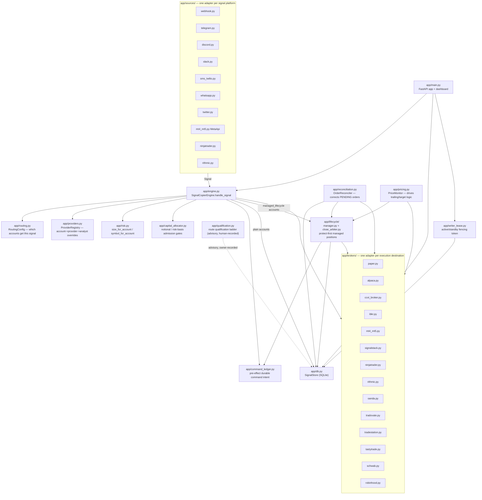

# Architecture

signal-copier is a single-process, single-tenant (owner) service that
ingests trade signals from multiple external sources, decides which of the
owner's own broker accounts should receive each one, sizes and risk-gates
it per account, and submits it to that account's broker. Every signal,
order result, and net position is logged in a local SQLite database. See
README.md for the full narrative; this document is the component map.

## Component overview

## Components

### Signal ingestion — `app/sources/`

One adapter per signal source, each subclassing `SourceAdapter`
(`app/sources/base.py`). A source's only job is turning whatever the
platform sends into a normalized `Signal` (`app/models.py`) and calling
`on_signal(signal)`, which in practice is always
`SignalCopierEngine.handle_signal`. Push-based sources (webhook, SMS,
WhatsApp, NinjaTrader's webhook) get an HTTP route mounted in
`app/main.py`; pull-based sources (Telegram/Discord/Slack bots, MT4/MT5
via MetaApi, Rithmic) are started as background tasks in the FastAPI
`lifespan` handler. The Telegram/Discord/Slack/SMS/Twitter parsers share
one generic free-text parser (`app/sources/text_parser.py`).

### The engine — `app/engine.py` (`SignalCopierEngine`)

The one place that knows about both sources and brokers. For every
incoming signal: resolves destination accounts (`app/routing.py`), applies
provider/analyst overrides (`app/providers.py`), sizes and symbol-maps per
account (`app/risk.py`), runs capital/risk admission gates
(`app/capital_allocator.py`), opens a durable command-ledger entry before
any broker call (`app/command_ledger.py`), and then either submits directly
to the broker (a plain account) or hands the signal to
`PositionLifecycleManager` (a `managed_lifecycle` account). A `CLOSE`
signal is resolved against this service's own tracked position, with an
additional broker-position reconciliation check before a plain account's
close is allowed to proceed (see `_reconcile_before_plain_close`).

### Execution — `app/brokers/`

One adapter per destination, each subclassing `BrokerAdapter`
(`app/brokers/base.py`). The base class declares one required method
(`place_order`) and a set of *optional* capabilities
(`place_protective_stop`, `cancel_order`, `replace_stop_quantity`,
`get_broker_position`, `get_last_price`, `get_account_balance`,
`get_order_status`) that default to no-ops. Capability is determined by
introspection — whether a subclass actually overrides the base method —
never a separately maintained boolean flag, so `GET /brokers` reports the
truth rather than a claim that can drift out of sync with the code.

| Broker | Native bracket (SL/TP) | Position readback | Last price (PriceMonitor) | Notes |
|---|---|---|---|---|
| `paper` | via managed-lifecycle protective stop only | yes | no | in-process mock, synchronous fills |
| `alpaca` | yes (bracket/OTO) | yes | yes | equity-only (`supported_asset_classes`); REST, no SDK |
| `ccxt` (+ multi-exchange) | yes (`stopLossPrice`/`takeProfitPrice`) | yes | yes | crypto-only; wraps 100+ ccxt exchanges |
| `ibkr` | yes (parent/child bracket) | no | yes | async fills via `ib_async`; PENDING until reconciled |
| `mt4_mt5` (same-host MT5) | yes (`sl`/`tp` fields) | no | no | Windows-only, one terminal per account |
| `mt4_mt5` (MetaApi cloud) | yes (`stop_loss`/`take_profit` params) | no | no | no local terminal needed |
| `signalstack` | no | no | no | relays to IBKR/Schwab/Alpaca/Tradier/etc.; HTTP-accept only, no fill feedback |
| `ninjatrader` | no | no | no | via TradeRouter's NinjaScript strategy; C# side unverified live |
| `rithmic` | no (ticks, not prices — unwired) | no | no | via async_rithmic; licensed credentials required |
| `oanda` | not disclosed as forwarded | no | no | forex; synchronous fill/reject, unlike Alpaca |
| `tradovate` | not disclosed as forwarded | no | no | US futures; always sends `isAutomated: true` |
| `tradestation` | not disclosed as forwarded | no | no | OAuth2, defaults to sim environment |
| `tastytrade` | not disclosed as forwarded | no | no | OAuth2, defaults to sandbox; unverified close-tagging |
| `schwab` | not disclosed as forwarded | no | no | **no sandbox at all** — gated behind `SCHWAB_ACKNOWLEDGE_NO_SANDBOX` |
| `robinhood` | not disclosed as forwarded | no | no | **no official API/sandbox, outside ToS** — gated behind `ROBINHOOD_ACKNOWLEDGE_TOS_RISK` |

A broker that can't forward `stop_loss`/`take_profit` on a plain account
gets its entry **refused outright** rather than silently opening an
unprotected position (`broker.supports_native_bracket` checked before
`place_order`). See docs/architecture/COMPONENTS.md for the full one-row-
per-module catalog and README.md's "Stop-loss / take-profit" section for
exactly which brokers forward native SL/TP.

### Managed lifecycle — `app/lifecycle/`

For a broker that can't submit entry+stop+target atomically, embedding
stop/target directly on the entry risks two independent legs both firing
(an oversell). Any `DestinationAccount` can opt into
`managed_lifecycle: true` instead:

    ENTRY -> actual fill observed -> protect the filled quantity FIRST
    -> manage targets/trailing as logical (app-side) instructions
    -> coordinate every exit through one CloseArbiter

- `app/lifecycle/models.py` — `PositionPlan`, `Target`, `TrailingPolicy`,
  `PendingExit`/`PendingEntry`/`TransferPhase`: account-agnostic
  description of an entry, its stop, and its exit behavior, including
  in-flight partial-fill/transfer state.
- `app/lifecycle/close_arbiter.py` — `CloseArbiter`: the single
  serialization point per `(account, symbol)` enforcing
  `available_to_sell = confirmed_owned_quantity - reserved_quantity`. A
  ledger invariant violation self-halts the position rather than risk a
  silent oversell.
- `app/lifecycle/manager.py` — `PositionLifecycleManager`: submits the
  entry, places the protective stop on the *actual confirmed fill*,
  evaluates logical targets/trailing on price updates, performs
  stop-resize transitions, and is the single execution-application owner
  for both entry and exit fills (position deltas only applied once the
  real outcome is known — see its module docstring for the full,
  hard-won correctness history across three review rounds).

### Persistence — `app/db.py` (`SignalStore`)

Plain stdlib `sqlite3` (no ORM). Every signal received, order result, and
this service's own tracked net position per `(account_id, symbol)` is
logged. Schema changes are versioned Alembic migrations
(`alembic/versions/`); a fresh or pre-Alembic database is stamped at the
current head on open. Also holds the live-managed config tables
(`config_accounts`, `config_routing_rules`, `config_providers`,
`config_analysts`), the `command_ledger`, `writer_lease`,
`route_qualifications`, `capital_reservations`, `lifecycle_state`
(crash-resumable managed-position snapshots), and several analytics tables
(`provider_subscriptions`, `provider_candidates`, `position_excursions`,
`account_equity_snapshots`, `stop_target_events`, `backtest_runs`,
`export_events`). See docs/database/SCHEMA.md for the full table catalog.

### Capital / risk admission — `app/capital_allocator.py`

Opt-in, per-account and owner-wide admission gates checked before a plain
or managed entry is submitted: `max_notional_exposure` (per account),
`risk_percent_of_equity` (per account, needs a fresh broker equity read),
and `MAX_OWNER_NOTIONAL_EXPOSURE` (process-wide, since this is a
single-tenant deployment). Current exposure is replayed from the
confirmed-fill journal (`app/economics.py`), never a separately maintained
running total. A signal with no resolvable price, or an account whose
exposure this replay can't fully resolve, is **rejected**, never treated
as zero. Concurrent admissions for the same account are serialized so two
signals can't both spend the same remaining capacity.

### Command ledger — `app/command_ledger.py`

A durable, pre-effect record (`command_ledger` table) written and
committed *before* every broker call in `app/engine.py` and
`app/lifecycle/manager.py` — entry, close, stop change, replace, cancel,
flatten. Tracks an `UncertaintyState` (`pending_submission` ->
`submitted_unconfirmed`/`unknown_ambiguous` -> `confirmed`/
`rejected_confirmed`) so a process crash between "decided to submit" and
"broker call returned" leaves a durable trace instead of silence, and an
ambiguous outcome (broker call raised, or returned PENDING/ERROR with no
order id) is recorded as `unknown_ambiguous`, never silently dropped.

### Writer-lease fencing — `app/writer_lease.py`

Cross-process, cross-host single-writer guard for the active/passive
multi-site deployment (see docs/architecture/SYSTEM_CONTEXT.md and
deploy/RUNBOOK.md). The shared SQLite database (replicated via Litestream)
is the only cross-host coordination point; a monotonically increasing
fencing token is issued exactly once per takeover
(`app/promote_cli.py`, always a deliberate human action, never automatic)
and every command-execution path re-checks the current token immediately
before acting. This is a second, automatic guard *below* the manual
promotion runbook, not a replacement for it — see docs/FAILOVER.md.

### Route qualification — `app/qualification.py`

A separate, higher-bar concept from `BrokerAdapter`'s code-derived
capability introspection: a strict, sequential ladder
(`implemented -> configured -> authenticated -> account_entitled ->
protocol_tested -> venue_tested -> release_approved`) tracked per exact
route (adapter type + route key + asset class + product type), enforced by
`SignalStore.record_route_qualification` (can't skip a rung). Advisory and
owner-recorded only — nothing in the codebase sets a qualification record
on its own initiative.

### Reconciliation — `app/reconciliation.py` (`OrderReconciler`)

Background loop (default 30s) that re-checks each PENDING order via the
broker's optional `get_order_status()` and corrects the tracked position:
reverses a rejected order's optimistic quantity, trues up a differing
confirmed fill. Only brokers implementing `get_order_status()` are covered
(currently Alpaca and IBKR). Also resolves pending managed-lifecycle
entries/exits and re-arms/resizes protective stops accordingly. One
broker's fault (a connection error, a corrupted response) doesn't block
reconciling the rest of that pass.

### Price monitoring — `app/pricing.py` (`PriceMonitor`)

Background loop (default 15s) polling `get_last_price()` for every open
managed-lifecycle position and feeding it into
`PositionLifecycleManager.on_price_update()`, driving trailing-stop
tightening and target evaluation in production. Only ccxt, Alpaca, and
IBKR have a real `get_last_price` implementation as of this writing — REST
polling, not a websocket/tick stream.

### Trade episodes & capability scouting — `app/trade_episode.py`,
`app/provider_value.py`, `app/provider_scout.py`

TR-EPISODE-01: `app/trade_episode.py` replays every filled order, grouped
by `orders.family_id`, into one `TradeEpisode` per position lifecycle
(entry/add-on/reduction/stop/target/trailing-stop/time_exit executions) --
the authoritative source for provider scoring. `app/provider_value.py`'s
`compute_provider_value_from_episodes`/`compute_provider_value_report_
from_episodes` (built on it) are the current, correct "still worth paying
for" scoring: a stop-out loss counts like a manual close, and a
multi-fill reduction of one position is one episode, not several. The
original FIFO-lot, closing-fill-based `compute_provider_value`/
`compute_provider_value_report` are kept as a deprecated fallback (see
that module's own docstring for why) -- new code should read the
episode-based report. `ProviderScout`'s scheduled background scan already
reads the episode-based report.

### The FastAPI app & dashboard — `app/main.py`

Wires everything above together: registers sources and brokers at
startup, mounts every HTTP route (ingestion webhooks, the CRUD config API,
monitoring endpoints, the backtester, market/economic context endpoints),
runs the `lifespan` handler (starts background loops, restores
crash-resumable lifecycle state, calls every broker's `close()` on
shutdown), and serves the single-page dashboard
(`app/static/dashboard.html`, vanilla JS, no build step). Owner
authentication (`app/auth.py`) gates every mutating/observability route
except `GET /health`.

## Background loops started at process startup

| Loop | Module | Default interval | Purpose |
|---|---|---|---|
| `OrderReconciler` | app/reconciliation.py | 30s | correct PENDING orders, resolve pending lifecycle entries/exits |
| `PriceMonitor` | app/pricing.py | 15s | drive managed-lifecycle trailing/target logic |
| `ProviderScout` | app/provider_scout.py | 1 day | evaluate free providers for subscription promotion |
| `WriterLeaseGuard` renewal | app/writer_lease.py / app/main.py | well under 30s lease TTL | keep this site's fencing token current |

See docs/architecture/DATA_FLOWS.md for the end-to-end sequence and
docs/architecture/DEPENDENCIES.md for what imports what.
