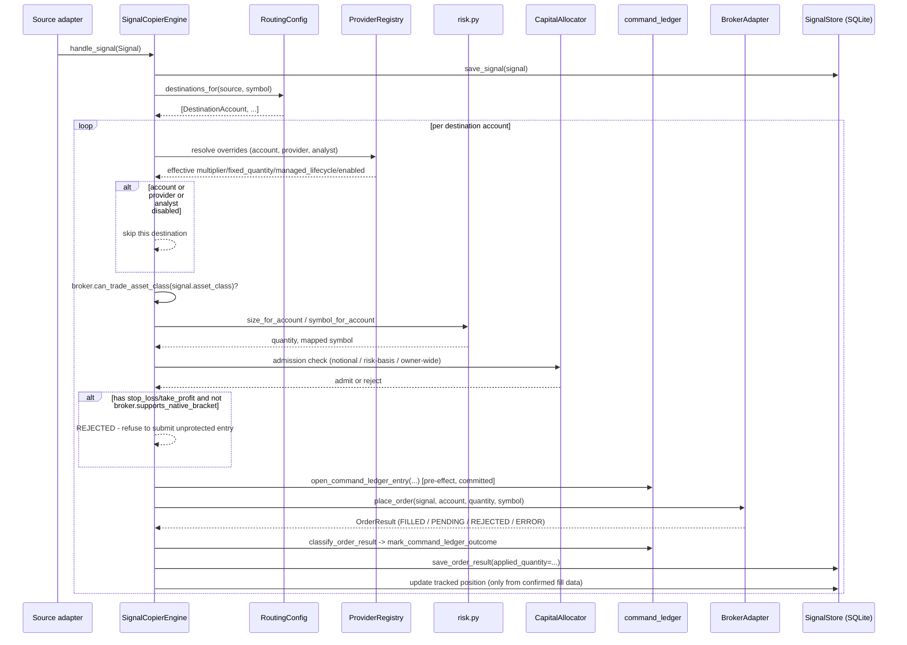
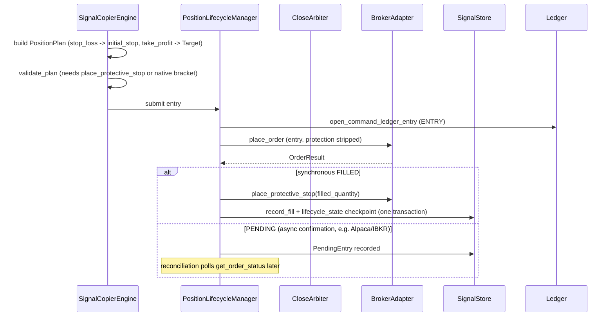
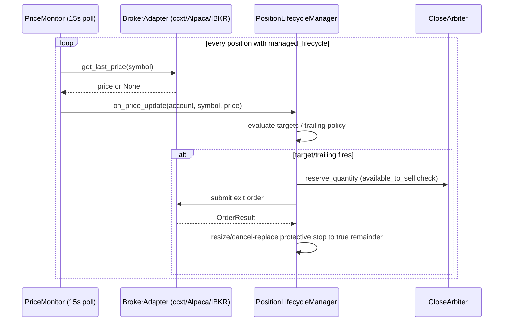
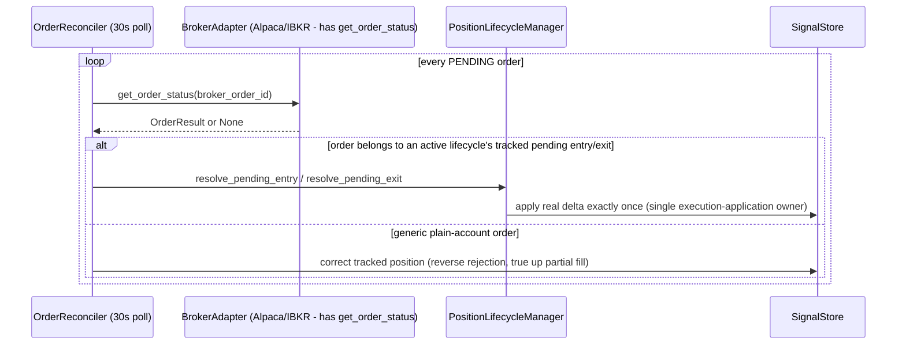

# Data Flows

## End-to-end: a plain-account entry signal



## End-to-end: a managed-lifecycle entry



## Continuous monitoring (background)





## Close signal resolution (plain account)

1. Look up this service's own tracked net position for
   `(account_id, mapped_symbol)` — `SignalStore.get_position`, its own
   record, not a live broker read.
2. Flat? `REJECTED` — "no open position to close" — no broker call.
3. **P0-5 reconciliation gate** — one of:
   - a fresh `BrokerAdapter.get_broker_position` readback matching the
     tracked quantity within tolerance, or
   - `DestinationAccount.exclusive_writer_qualified = True` (an explicit,
     off-by-default operator assertion).
   Neither holding: `REJECTED`, never proceeds on an unproven projection.
4. Resolve to the opposing BUY/SELL at the full open quantity, call
   `place_order`. Serialized per `(account_id, symbol)` so two concurrent
   close attempts can't both oversell.

On a `managed_lifecycle` account, the equivalent serialization and
reconciliation is `CloseArbiter`'s job — see
docs/architecture/ARCHITECTURE.md's "Managed lifecycle" section.

## Export to the commercial platform

```mermaid
sequenceDiagram
    participant Eng as SignalCopierEngine / Lcm
    participant Exp as export_events.py
    participant Store as SignalStore (export_events table)
    participant Sched as relay_scheduler.py
    participant Worker as relay_worker.py
    participant SPC as signal-portfolio-commercial

    Eng->>Exp: build_execution_applied_envelope(...)
    Exp->>Store: append to export_events outbox
    loop scheduled
        Sched->>Worker: run_once(pending export_events)
        Worker->>Worker: sign_relay_payload (HMAC)
        Worker->>SPC: POST signed batch
        SPC-->>Worker: ack
        Worker->>Store: mark delivered
```
    end
