# Dependencies

## Internal module dependency directions

The engine is the hub; sources and brokers never depend on each other
directly (README.md: "Sources and brokers know nothing about each
other"). Arrows below mean "imports from" / "calls into."

```mermaid
flowchart TD
    main[app/main.py] --> engine[app/engine.py]
    main --> db[app/db.py]
    main --> auth[app/auth.py]
    main --> writer_lease[app/writer_lease.py]
    main --> reconciliation[app/reconciliation.py]
    main --> pricing[app/pricing.py]
    main --> provider_scout[app/provider_scout.py]
    main --> sources[app/sources/*]
    main --> brokers[app/brokers/*]

    engine --> routing[app/routing.py]
    engine --> risk[app/risk.py]
    engine --> providers[app/providers.py]
    engine --> capital_allocator[app/capital_allocator.py]
    engine --> command_ledger[app/command_ledger.py]
    engine --> db
    engine --> lifecycle_manager[app/lifecycle/manager.py]
    engine --> brokers
    engine --> models[app/models.py]

    lifecycle_manager --> lifecycle_models[app/lifecycle/models.py]
    lifecycle_manager --> close_arbiter[app/lifecycle/close_arbiter.py]
    lifecycle_manager --> command_ledger
    lifecycle_manager --> db
    lifecycle_manager --> brokers

    capital_allocator --> economics[app/economics.py]
    capital_allocator --> db

    reconciliation --> db
    reconciliation --> lifecycle_manager
    reconciliation --> brokers

    pricing --> lifecycle_manager
    pricing --> brokers

    routing --> models
    risk --> models
    providers --> models
    sources --> models
    brokers --> models

    writer_lease --> db

    export_events[app/export_events.py] --> models
    relay_worker[app/relay_worker.py] --> export_events
    relay_scheduler[app/relay_scheduler.py] --> relay_worker
```

Notable directions worth remembering when changing code:

- `app/engine.py` depends on `app/capital_allocator.py`,
  `app/command_ledger.py`, `app/routing.py`, `app/risk.py`,
  `app/providers.py`, and `app/lifecycle/manager.py` — not the reverse.
- `app/lifecycle/manager.py` depends on `app/lifecycle/close_arbiter.py`
  and `app/command_ledger.py`, and is itself depended on by
  `app/reconciliation.py` and `app/pricing.py` (both call into the
  lifecycle manager to resolve pending entries/exits and drive price
  updates) — `app/lifecycle/*` never imports `app/reconciliation.py` or
  `app/pricing.py`.
- `app/capital_allocator.py` depends on `app/economics.py`'s confirmed-fill
  replay for current exposure — it does not read a broker balance
  directly (see `BrokerAdapter.get_account_balance`'s own docstring on
  why that's deliberate).
- `app/writer_lease.py` depends only on `app/db.py` (the shared SQLite
  table is the only cross-host coordination point) and is otherwise
  self-contained.
- `app/brokers/*` and `app/sources/*` depend only on `app/models.py`
  (plus their own optional third-party SDK) — never on `app/engine.py`,
  `app/db.py`, or each other. This is what keeps "adding a new
  source/broker" a two-step change (subclass + register in
  `app/main.py`).
- `app/qualification.py` is a standalone module with no dependency on
  `app/engine.py` or the brokers — it's written to only via
  `SignalStore.record_route_qualification`, called from `app/main.py`'s
  owner-gated `POST /qualifications` route.

## External dependencies (`requirements.txt`)

### Always installed

| Package | Why |
|---|---|
| `fastapi` | the HTTP app and dashboard API |
| `uvicorn[standard]` | ASGI server |
| `pyyaml` | one-time `config/*.yaml` import path (`app/config_admin.py`) |
| `pydantic` | request/response models |
| `sqlalchemy` (Core only) | transactional primitives + Alembic's own dependency; no ORM rewrite |
| `alembic` | versioned schema migrations (`alembic/versions/`) |
| `pydantic-settings` | typed env-var config (`app/config.py`) — fails loud on a malformed value |
| `prometheus_client` | `GET /metrics` |
| `structlog` | correlated structured logs for the core financial path |
| `httpx` | plain-REST brokers with no SDK: SignalStack, Alpaca, NinjaTrader |
| `python-multipart` | FastAPI `Form()` parsing, used by `/sms/twilio` |
| `slowapi` | per-IP rate limiting on webhook/SMS ingress |
| `aiolimiter` | outbound quota limiter for `app/context/*` |
| `pwdlib[argon2]` | optional `OWNER_PASSWORD_HASH` (argon2id) alternative to plain `OWNER_PASSWORD` |

### Installed unconditionally for test coverage, needed live only if that adapter is used

| Package | Why |
|---|---|
| `twilio` | SMS source request-signature validation |
| `tweepy` | Twitter/X source |
| `ib_async` | IBKR broker (maintained community fork of the archived `ib_insync`) |
| `async_rithmic` | Rithmic source/broker; live trading also needs licensed Rithmic credentials |

### Optional, commented out — install only for the adapter you enable

| Package | Adapter |
|---|---|
| `ccxt` | `CCXTBroker` |
| `python-telegram-bot` | Telegram source |
| `discord.py` | Discord source |
| `slack-bolt` | Slack source |
| `MetaTrader5` | same-host MT5 broker (Windows only) |
| `metaapi-cloud-sdk` | MT4/MT5 via MetaApi (source and broker) |

NinjaTrader's broker adapter needs no extra Python package (plain
`httpx`) but does need TradeRouter's `WebhookOrderStrategy.cs` compiled
inside a real NinjaTrader install.

### Test/dev-only

| Package | Why |
|---|---|
| `pytest`, `pytest-asyncio` | test runner |
| `hypothesis` | generated/stateful property tests (quantity-conservation invariants) |
| `schemathesis` | OpenAPI schema fuzzing of the bounded read-only endpoint set |
| `mutmut` | mutation testing, scoped to `app/auth.py` |
| `playwright`, `axe-playwright-python` | real-browser dashboard tests (XSS regression, accessibility) |
| `ruff` | lint (narrow ruleset: `F` pyflakes + `B` bugbear) |
| `mypy` | type checking, CI-scoped file list (see .github/workflows/signal-copier-ci.yml) |
| `types-PyYAML` | stubs for `app/routing.py`'s `import yaml` |

### Cross-repo dependency

`-e ../signal_platform_contracts` — a pure contract package (event
envelope + identity types) shared with signal-portfolio-commercial, with
no DB/broker/secret imports of its own. See
docs/architecture/SYSTEM_CONTEXT.md for the boundary it crosses.
