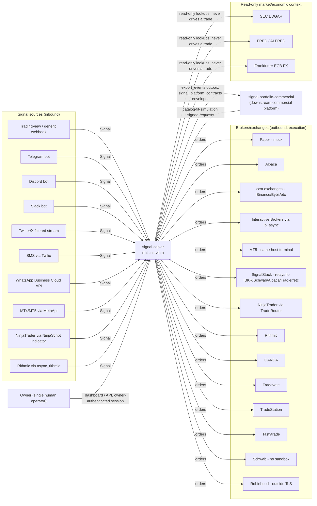

# System Context

signal-copier is a single-tenant (one owner) service. Every external actor
below is either something the owner's own signals/orders flow through, or
a downstream platform this service exports data to. Nothing here is
multi-tenant SaaS; there is no concept of another customer's data existing
in the same process.

## Inbound: signal sources

| Source | Transport | What crosses the boundary |
|---|---|---|
| Generic/TradingView webhook | Push, `POST /webhook/{source_name}` | Raw JSON payload; requires `WEBHOOK_SHARED_SECRET` or the route is disabled (`503`) |
| Telegram | Pull, bot polling (`python-telegram-bot`) | Message text + sender identity (username/full name as `analyst`) |
| Discord | Pull, bot (`discord.py`) | Message text + author as `analyst` |
| Slack | Pull, bot (`slack-bolt`) | Message text + raw Slack user ID as `analyst` |
| Twitter/X | Pull, filtered stream (`tweepy`) | Tweet text + numeric author ID as `analyst`; needs a paid X API tier |
| SMS | Push, `POST /sms/twilio` | Twilio webhook payload, HMAC-validated via `TWILIO_AUTH_TOKEN`; sender phone number as `analyst` |
| WhatsApp | Push, `POST /whatsapp/webhook` | Meta WhatsApp Business Cloud API payload, HMAC-SHA256 validated via `WHATSAPP_APP_SECRET` |
| MT4/MT5 | Pull, polled deal history via MetaApi cloud | Deal events from a connected MT4/MT5 account |
| NinjaTrader | Push, `POST /ninjatrader/webhook` | `Account.ExecutionUpdate` events from a NinjaScript indicator running inside NinjaTrader, HMAC-validated via `NINJATRADER_WEBHOOK_SECRET` |
| Rithmic | Pull, `async_rithmic` | Trade events from a licensed Rithmic account |

Every source produces a normalized `Signal` (`app/models.py`) — the one
contract the engine consumes regardless of origin.

## Outbound: brokers/exchanges

Each `DestinationAccount` maps to exactly one broker connection with its
own credentials (env vars per `account_id`, never stored in the database
or config files). See docs/architecture/ARCHITECTURE.md's broker table for
each adapter's real capability differences (native bracket, position
readback, last-price polling). Two of these (`schwab`, `robinhood`) are
gated behind an explicit acknowledgement flag because they have no sandbox
and/or operate outside the vendor's own Terms of Service.

## Outbound: downstream commercial platform (`signal-portfolio-commercial`)

A separate repository/service in this same monorepo. Two boundaries cross
to it:

1. **Export outbox** (`app/export_events.py`, the `export_events` table) —
   `EXECUTION_APPLIED`-style envelopes defined by the shared
   `signal_platform_contracts` package (a pure contract package: event
   envelope + identity, no DB/broker/secret imports). This is a one-way
   push of execution facts outward.
2. **Catalog fit-simulation** (`POST /catalog/providers/{source}/fit-simulation`)
   — an inbound call FROM signal-portfolio-commercial's own backend, on
   behalf of an anonymous public-catalog visitor, authenticated by a
   signed, audience-bound, expiring service token
   (`X-Catalog-Fit-Sim-Signature`, `app/services/catalog_fit_sim_auth.py`)
   rather than an owner session — this is a genuinely separate route that
   authenticates to nothing else in this service.

## Read-only: market/economic context (`app/context/`)

Three free, publicly documented APIs an operator can look up alongside
live signal/position data. **Nothing in this package is imported by
`app/engine.py`, `app/lifecycle/*`, `app/reconciliation.py`, or any
`app/brokers/*.py` adapter** — it cannot place, cancel, or modify an order
and never drives a trading decision automatically.

| Service | Module | Auth | Notes |
|---|---|---|---|
| SEC EDGAR | app/context/sec_edgar.py | keyless (`SEC_EDGAR_USER_AGENT` required) | filing history + XBRL company facts |
| FRED/ALFRED | app/context/fred.py | `FRED_API_KEY` | macro series, supports point-in-time (`realtime_start`/`realtime_end`) reads |
| Frankfurter | app/context/fx.py | keyless | daily ECB reference FX, not an executable bid/ask |

Each self-imposes an outbound call-rate ceiling (`aiolimiter`) protecting
this process's own IP from being blocked by the upstream provider.

## The Owner

There is no user database and no multi-user concept. `app/auth.py` checks
one shared password (`OWNER_PASSWORD`/`OWNER_PASSWORD_HASH`) against a
constant-time comparison and issues a server-side session
(`SignalStore.sessions`) plus a double-submit CSRF token. Every mutating
or data-exposing route except `GET /health` requires that session.

## Multi-site deployment boundary

`deploy/` documents (not yet applied to a real cloud account) an
active/passive topology: one active site plus one warm-standby site,
coordinated through a shared, Litestream-replicated SQLite database and a
monotonic fencing token (`app/writer_lease.py`). Promotion between sites
is always a deliberate, human-run action (`python -m app.promote_cli`),
never automatic. See docs/FAILOVER.md and deploy/RUNBOOK.md.
