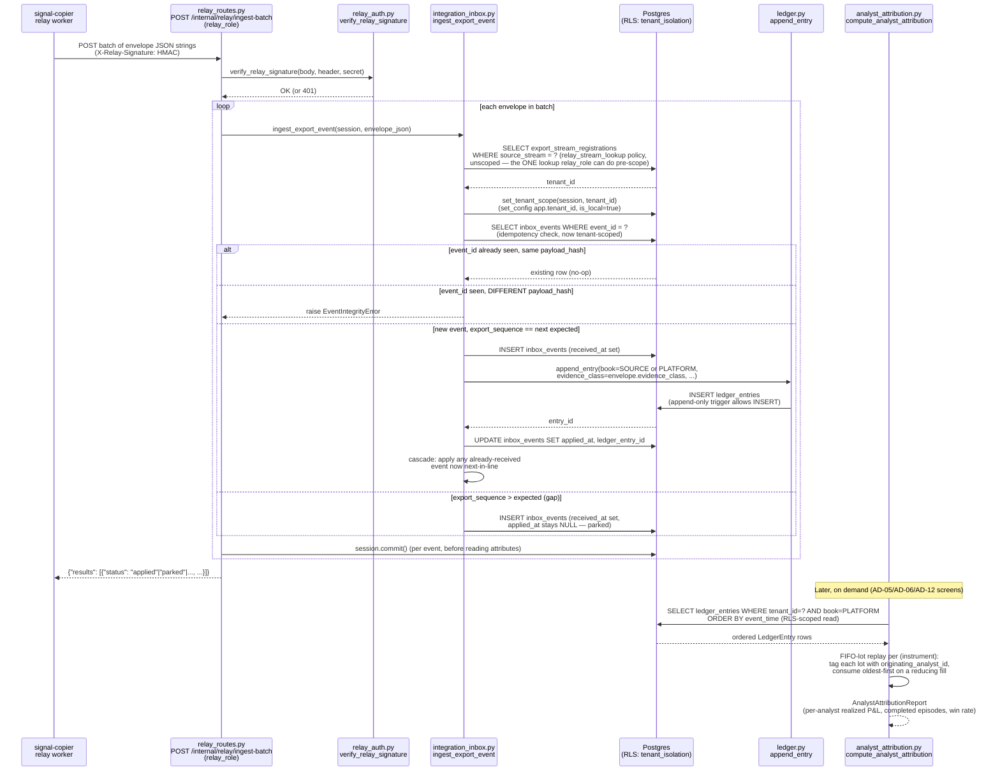
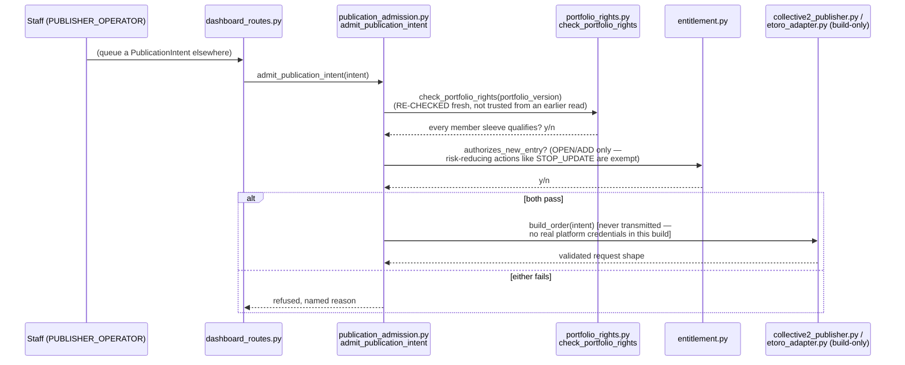
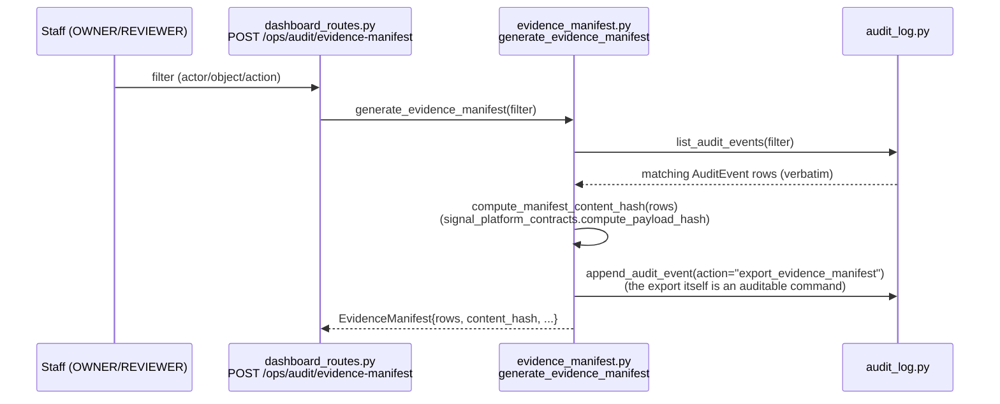

# Data Flows

## Flow 1: signal-copier execution → commercial ledger → analyst attribution

The real, end-to-end path from a signal-copier fill to a number a staff
member or customer sees.

Key invariants this flow enforces (see ARCHITECTURE.md §2–3 for why):

- The envelope never carries a `tenant_id` — only the owner-registered
  `ExportStreamRegistration` row determines which tenant an event
  belongs to.
- Nothing is ever silently coerced: an unsupported schema version,
  unimplemented event type, generation rollback, or manifest
  inconsistency **parks** the row with a named `parked_reason` rather
  than fabricating a projection.
- `ledger_entries` is append-only at the database level (a trigger, not
  just application discipline) — a `FEE` correction is a **new** row
  (`correction_of`), never an edit of the original `EXECUTION_APPLIED`
  entry.
- `analyst_attribution.py`'s per-analyst sum is guaranteed (by
  construction of the FIFO replay) to reconcile exactly to
  `platform_performance.py`'s blended aggregate for the same
  tenant/book — no P&L is ever duplicated or dropped between the two
  views.

## Flow 2: Publication admission (staff intent → publisher adapter)

## Flow 3: Audit trail → evidence manifest export (AD-18)

